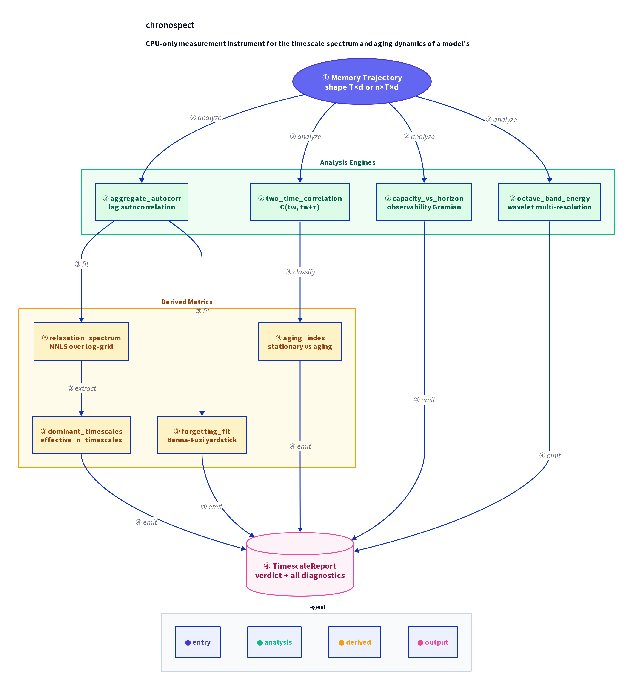

# chronospect

**A CPU-only measurement instrument for the *timescale spectrum* and *aging dynamics* of a model's memory.**

Modern architectures *claim* to hold memory at multiple timescales — Titans, HOPE / Nested
Learning's Continuum Memory System, test-time learners, deep state-space models. The claim is
architectural. What has been missing is an **instrument that checks whether a model's memory is
actually multi-timescale, or whether it has quietly collapsed to a single effective speed** — and
whether that memory is *stationary* or *aging* during training.

`chronospect` reads a logged memory trajectory and answers:

- **Spectrum** — *which* relaxation timescales are actually present (not just how many)?
- **Capacity-vs-horizon** — how many independent past directions survive `τ` steps?
- **Aging** — is the memory time-translation invariant, or does it coarsen (older memory relaxing more slowly)?
- **Forgetting yardstick** — does decay follow a single exponential or the Benna–Fusi power law `τ^-1/2`?

It needs only a trajectory array and runs on a laptop CPU. No GPU, no model weights bundled, MIT licensed.

> **Status: v0.2.0a1 (alpha).** The validation numbers below come from **synthetic** ground-truth data
> with known injected timescales (see [Validation](#validation-the-sensitivity-gate)). A small
> [exploratory case study](examples/case_study.md) looks at real GRU and Titans memory before/after
> training, but `chronospect` has **not** been used to publish a *validated* finding about a real model.
> It is a measurement tool whose calibration is **characterised, not hidden** — including a
> [residual long-timescale bias](#calibration-how-to-read-a-recovered-timescale) it discloses rather
> than corrects away.

---

## Install

```bash
pip install chronospect            # core (numpy, scipy, PyWavelets)
pip install "chronospect[torch]"   # + the optional torch trajectory loggers
```

Or from source:

```bash
git clone https://github.com/hinanohart/chronospect
cd chronospect && pip install -e ".[dev]"
```

---

## Quickstart

```bash
chronospect gate     # validate the instrument on synthetic ground truth
chronospect demo     # analyze a synthetic memory with injected timescales 5 and 100
```

```python
import chronospect as cs

# X is your memory trajectory: (T, d) for one run, or (n, T, d) for an ensemble.
report = cs.analyze(X)
print(report.verdict)               # e.g. "multi-timescale; approximately stationary"
print(report.dominant_timescales)   # e.g. [3.6, 68.7]
print(report.aging_index)           # 0.0 == stationary; larger == aging
print(report.capacity_horizon_half) # lag at which memory capacity halves
```

### Getting a trajectory out of a model

```python
from chronospect.loggers import TrajectoryRecorder, record_rnn_states, from_snapshots

# 1) generic: record any per-step state you can name
rec = TrajectoryRecorder()
for step in rollout:
    rec.record(model.memory_state())     # array-like or torch tensor
X = rec.trajectory()                      # (T, d)

# 2) torch forward hook (records a module's output each call)
with TrajectoryRecorder().attach(model.memory_module) as rec:
    model(batch)
X = rec.trajectory()

# 3) RNN hidden states, step by step
X = record_rnn_states(torch.nn.GRU(8, 16), inputs)   # (T, 16)

# 4) weight-space memory across continual-learning tasks
X = from_snapshots([snapshot_after_task_i for i in range(n_tasks)])  # (n_tasks, d)
```

---

## How it works

`cs.analyze(X)` is the single entry point. Under the hood it runs six estimators in sequence:

1. **Autocorrelation** (`aggregate_autocorr`) — computes a lag-autocorrelation curve, averaging
   across the `d` dimensions and, if given an ensemble, across the `n` runs.
2. **Relaxation spectrum** (`relaxation_spectrum`) — fits the autocorrelation curve to a
   non-negative weighted sum of exponentials on a log-spaced timescale grid (NNLS). The resulting
   weight profile is the spectrum. `dominant_timescales` then picks peaks above a relative
   threshold; `effective_n_timescales` summarises the spread as an entropy-like scalar.
3. **Capacity vs horizon** (`capacity_vs_horizon`) — uses a data-driven observability Gramian
   (whitened canonical correlations) to estimate how many independent "past directions" survive
   each lag `τ`. The half-capacity lag is reported as `capacity_horizon_half`.
4. **Two-time correlation and aging** (`two_time_correlation`, `aging_index`) — computes
   `C(t_w, t_w + τ)` for a range of waiting times `t_w`, then checks whether the curves shift as
   `t_w` grows (aging) or remain constant (stationary). A significance-gated slope test produces
   the `aging_index`.
5. **Forgetting yardstick** (`forgetting_fit`) — fits the autocorrelation tail to both a single
   exponential and the Benna–Fusi power law `τ^-1/2`, and reports which fits better. This is a
   reference yardstick only, never reported as a standalone finding.
6. **Octave-band energy** (`octave_band_energy`) — decomposes the trajectory via wavelet
   multi-resolution analysis and reports the fraction of detail energy in each frequency octave,
   as an assumption-light cross-check of the spectral result.

The `verdict` field of `TimescaleReport` combines the spectral result (`n_dominant_timescales`,
`effective_n_timescales`) with the aging result to produce a plain-English summary such as
`"multi-timescale; approximately stationary"`.

---

## Architecture overview

<div align="center">
  
</div>

---

## Why these methods (the cross-disciplinary part)

Each diagnostic imports a mature idea from another field that, as far as we can find, has **not** been
applied to model memory as a shipped instrument:

| Diagnostic | Borrowed from | What it measures |
|---|---|---|
| `relaxation_spectrum` | Dynamic-light-scattering / rheology relaxation spectra (NNLS over a log-grid of exponentials) | Timescales present in the autocorrelation |
| `two_time_correlation` + `aging_index` | Two-time correlation `C(t_w, t_w+τ)` of glassy / spin-glass physics | Whether memory dynamics are stationary or *aging* |
| `capacity_vs_horizon` | Observability Gramian of control theory, made data-driven via whitened canonical correlations | How many past directions remain recoverable at horizon `τ` |
| `octave_band_energy` | Wavelet multi-resolution analysis | Update energy per frequency octave (assumption-light cross-check) |
| `forgetting_fit` | Benna–Fusi cascade memory optimal forgetting law (`τ^-1/2`) | Exponential vs power-law decay (reference yardstick only) |

---

## Validation: the sensitivity gate

Before pointing the instrument at any real model it must recover structure it *injected itself*.
The pass/fail criteria are **pre-registered** in `chronospect/sensitivity.py` (fixed in advance, not
tuned until the pictures look nice). If `chronospect` can't recover timescales it planted in a toy, it
must not be trusted on a network.

```text
$ chronospect gate
GATE PASS
  [ok] G1_recover_two_timescales: injected=(5.0, 100.0) recovered=[3.6, 65.2]
  [ok] G2_single_is_single: n_peaks=1 n_eff=1.20 (<1.8)
  [ok] G3_capacity_horizon: cap_multi[200]=1.004 > cap_fast[200]=0.093
  [ok] G4_aging_detected: aging=0.990 stationary=0.000 (margin>=0.3)
  [ok] G5_no_false_aging: stationary multi-timescale aging=0.000 (<0.25)
  [ok] G6_calibration_holdout: recovered/injected 7:1.00[0.6,1.5], 40:0.90[0.6,1.5], 150:0.78[0.55,1.5], 300:0.64[0.58,1.45] single20_one_peak=True
  [ok] G7_real_model_smoke: skipped (torch not installed)
```

- **G1/G2** the spectrum recovers two well-separated injected timescales (to within a factor of ~2,
  the log-grid resolution) and reports a single-speed memory as single.
- **G3** a genuinely multi-timescale memory retains more capacity at a long horizon than a fast one.
- **G4/G5** an *aging* process is flagged, while a stationary memory — **even one split across several
  timescales** — is **not** (the aging index uses a significance-gated slope, so finite-ensemble noise
  does not fake aging).
- **G6** calibration on **hold-out** timescales `(7, 40, 150, 300)` — disjoint from the G1 timescales,
  so the calibration cannot be tuned by fitting the gate grid — checks that recovery lands in a
  pre-registered two-sided band (and that a single-speed memory still resolves to one peak). The band
  was fixed *before* the v0.2 calibration code; see [Calibration](#calibration-how-to-read-a-recovered-timescale).
- **G7** a torch-gated end-to-end smoke (an `nn.GRU` trajectory flows through `analyze`). With
  `chronospect[torch]` installed it runs the GRU smoke; on the torch-free core it is skipped and counted
  as passing, so the core test matrix stays GPU- and torch-free.

The gate is also the test suite (`pytest`), run across multiple seeds.

---

## Calibration: how to read a recovered timescale

Recovering a relaxation timescale from a finite window is an ill-posed inverse problem: **long
timescales are systematically under-recovered** (the larger the true timescale relative to the
observation window, the more it is shrunk). `chronospect` **discloses** this instead of hiding it. The
table below is generated by `cs.calibrate(...)` on synthetic single-timescale data with *known* answers
(`results/calibration_v0.2.json`, reproducible):

| injected τ | recovered/τ (default) | recovered/τ (`bias_correct=True`) |
|---:|:---:|:---:|
| 7   | 0.96 | 0.97 |
| 20  | 0.93 | 0.97 |
| 50  | 0.83 | 0.91 |
| 100 | 0.71 | 0.80 |
| 200 | 0.56 | 0.68 |
| 300 | 0.45 | 0.61 |

Read a recovered long timescale as a **shrinkage-affected estimate / lower bound**, not an exact value.
(The gate's `G6` check runs the same single-timescale recovery on a smaller hold-out set — 3 seeds,
timescales 7/40/150/300 — so its printed ratios differ slightly from this fuller curve; both are
reproducible synthetic runs.)

An **opt-in** demeaning-bias correction is available:

- Enable via `aggregate_autocorr(..., bias_correct=True)` or `analyze(..., bias_correct=True)`.
- Lifts long-timescale recovery (e.g. τ=300 from 0.45 to 0.61) by removing the *identifiable* finite-sample part of shrinkage.
- **Cannot** remove the residual finite-window shrinkage.
- **Cost:** broadens the apparent spectrum of a genuinely single-speed memory (effective timescales 1.22 → 1.55).
- **Off by default** — the default preserves the single-vs-multi discrimination the gate checks. Enable it when long-timescale calibration matters more than the single-vs-multi headline.

`chronospect` never silently rescales a reading and never claims exact point recovery.

---

## Exploratory case study (not validation)

[`examples/case_study.md`](examples/case_study.md) trains a small `nn.GRU` and a Titans `NeuralMemory`
on a toy next-step-prediction task and reads each model's memory-trajectory spectrum **before and after
training** on a held-out probe (`results/realmodel_v0.2.json`; regenerate with `python examples/run_case_study.py`).

This case study is deliberately narrow:

- Shows the instrument **responds to learning** — the recovered spectrum changes once the model has been trained.
- Makes **no cross-model comparison or ranking** and no claim that a recovered timescale equals an injected one.
- Uses tiny CPU configs, synthetic toy data, one seed per model — **exploratory only**.

For example: the Titans readout's verdict moves from "effectively single-speed" before training to
"multi-timescale" after, and the GRU's recovered fast peak shifts with training. See the case study
for full tables and caveats.

---

## Honest limitations

- **Synthetic validation; one exploratory real-model case study.** The validated numbers come from toy
  AR(1)/aging processes with known answers; the real-model [case study](#exploratory-case-study-not-validation)
  is exploratory, not a validation. Treat readings on real models as exploratory until corroborated.
- **Long timescales are under-recovered** (an ill-posed finite-window inversion); resolution is ~a
  factor of 2. Read the spectrum as bands present / lower bounds, not exact constants — see the
  [calibration table](#calibration-how-to-read-a-recovered-timescale) and the opt-in `bias_correct`
  correction, which lifts but cannot eliminate the long-timescale shrinkage.
- **Aging detection needs an ensemble.** With a single trajectory the two-time correlation is noisy;
  pass several runs (`(n, T, d)`) for a reliable `aging_index`.
- **The autocorrelation assumes local stationarity** for the spectrum; on strongly non-stationary
  memory read the two-time / aging output first.
- The Benna–Fusi power-law fit is a **reference yardstick only** — a single power-law fit is close to
  trivial and is never reported as a standalone claim.

---

## Prior work and relation to it

There are excellent implementations of multi-timescale *architectures* and continual-learning
*benchmarks*, but we could not find a shipped instrument that *measures* a memory's timescale spectrum
and aging. In particular, the Nested Learning / HOPE line explicitly **describes** "gradient-memory
dashboards" and frequency-band diagnosis of forgetting as a direction; the public HOPE/Nested-Learning
repositories ship *training* dashboards (loss / throughput), not a memory-timescale measurement tool.
`chronospect` operationalizes that measurement, model-agnostically, from a logged trajectory.

- Benna & Fusi, *Computational principles of synaptic memory consolidation*, Nat. Neurosci. 2016.
- Roy & Vetterli, *The effective rank of a matrix*, EUSIPCO 2007.
- Two-time correlation & aging: standard tools in the statistical physics of glasses.
- Behrouz et al., *Nested Learning / Titans* (multi-timescale memory architectures).
- Continual-learning frameworks (e.g. Avalanche, LibContinual) report accuracy / BWT-FWT — a different,
  complementary axis from timescale structure.

This is a measurement instrument, not a method that improves a model. If you find a place where this
measurement is already shipped, please open an issue — we would rather cite it than duplicate it.

---

## License

MIT © 2026 hinanohart. See [LICENSE](LICENSE).

